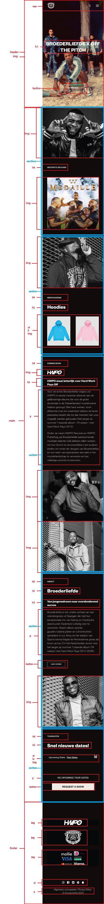
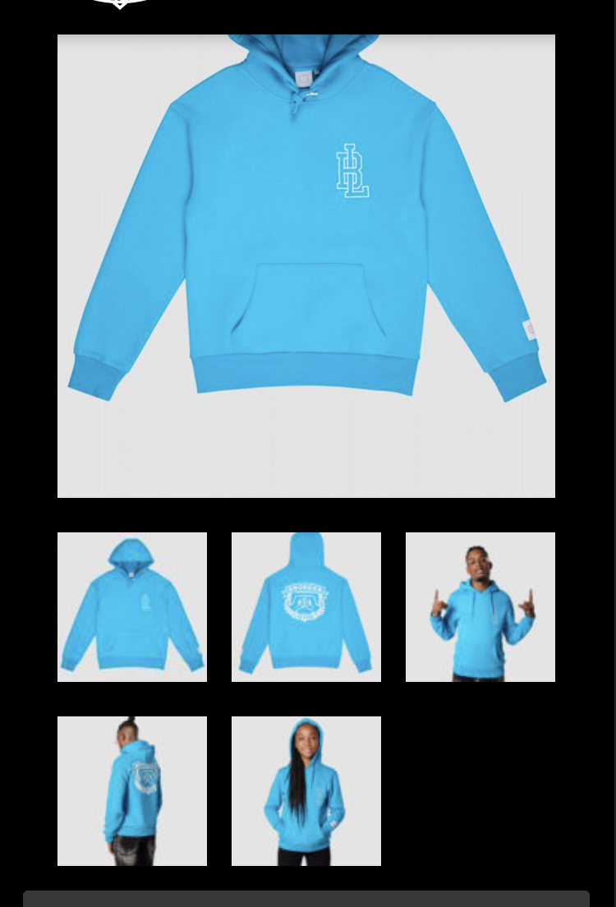
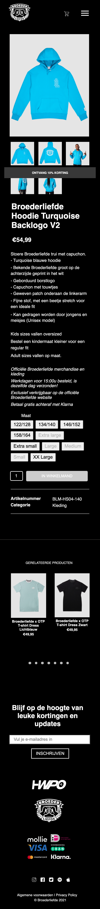

# Procesverslag
Markdown is een simpele manier om HTML te schrijven.
Markdown cheat cheet: [Hulp bij het schrijven van Markdown](https://github.com/adam-p/markdown-here/wiki/Markdown-Cheatsheet).

Nb. De standaardstructuur en de spartaanse opmaak van de README.md zijn helemaal prima. Het gaat om de inhoud van je procesverslag. Besteedt de tijd voor pracht en praal aan je website.

Nb. Door *open* toe te voegen aan een *details* element kun je deze standaard open zetten. Fijn om dat steeds voor de relevante stuk(ken) te doen.

## Jij

uitwerken voor kick-off werkgroep

### Auteur:
Liz Eijking

#### Je startniveau:
Blauwe piste

#### Je focus:
Surface plane

## Je website

uitwerken voor kick-off werkgroep

### Je opdracht:
https://broederliefde.com

#### Screenshot(s) van de eerste pagina (small screen):
Home pagina

#### Screenshot(s) van de tweede pagina (small screen):
Detailpagina

## Breakdownschets

uitwerken na afloop 2e werkgroep

### de hele pagina:

### de hele tweede pagina:

## Voortgang

uitwerken voor voortgang

### Stand van zaken
Ik snap niet hoe ik de afbeeldingen over de hele breedte van de pagina krijg en hoe ik de tour dates het beste kan aanpakken. Ook wilde ik weten hoe je bij de tweede pagina elementen kunt aanroepen in css

### Verslag van meeting
hier na afloop snel de uitkomsten van de meeting vastleggen

- body: margin: 0; om er voor te zorgen dat de afbeeldingen over de hele breedte van de pagina liggen
- in plaats van p tags, h tags gebruiken
- divs veranderen naar mooie elementen
- sections gebruiken
- border mag wel in px, voor de rest em gebruiken
- het gedeelte van de tourdates kan ik fixen door er een section omheen te zetten
- bij de tweede html pagina mag je wel classes gebruiken, omdat je dan die classes kan aanroepen in css

## Toegankelijkheidstest

uitwerken na test in 8e voortgang

### Bevindingen
- Screenreader is verschrikkelijk
- Niet alles kan met het toetsenbord geselecteerd worden

#### Screenrader
Nog niet al mijn afbeeldingen hadden een alt, ik snapte niks van de screenreader. Sommige delen worden voorgelezen door een
engelse man.

Ik heb al mijn afbeeldingen nu een alt gegeven en nog een keer getest hoe het nu met een screenreader gaat.

#### Toetsenbord
Niet alles kon nog met het toetsenbord geselecteerd worden, maar ze werden wel in een logische volgorde geselecteerd.

Ik had nog niet voor elk element verschillende states uitgewerkt, dat heb ik nu wel gedaan.

## Eindgesprek

uitwerken voor eindgesprek

### Stand van zaken
Ik ben heel erg trots op het eindresultaat. In het begin maakte ik nog veel gebruik van divs en classes.
Na het voortgangsgesprek heb ik dit aangepast en ben ik verder gegaan met de tweede pagina. Ik had veel moeite
met de micro-interactie, ik wilde eerst voor de winkelmand gaan maar ben uiteindelijk voor een hamburger menu gegaan, dit
omdat ik dit ook nog nooit heb gekund. Na eindeloos youtube filmpjes kijken en alles uitproberen was het me dan eindelijk gelukt!

Toen ik aan de tweede pagina begon, voelde ik me net een nerd want dit ging soepeler dan ik had gedacht.
Ik had nog wel veel moeite om de foto's mooi te zetten zoals de echte site dat heeft:

Uiteindelijk heb ik dit met grid op kunnen lossen.

Wat ik echt niet voor elkaar kreeg was met de tab zien dat het logo en winkelmand geselecteerd zijn, na veel onderzoek is het gelukt door op die 2 images in de html een "tabindex="0" te plaatsen.

Al met al ben ik heel erg blij met het eindresultaat!

### Screenshot(s)

hier screenshot(s) van je eindresultaat

## Bronnenlijst

continu bijhouden terwijl je werkt

Nb. Wees specifiek ('css-tricks' als bron is bijv. niet specifiek genoeg).

1. https://www.w3schools.com/howto/howto_css_button_on_image.asp (button op afbeelding)
2. https://codepen.io/Lizeijking/pen/yLaaBgM (positioneren over tekst)
3. https://codepen.io/Lizeijking/pen/YzGGayz (social media buttons met flex)
4. https://www.youtube.com/watch?v=zdA3qZNH1vc (social media buttons footer)
5. https://www.youtube.com/watch?v=QmG9lSEhbwc (formulier)
6. https://www.w3schools.com/css/css_z-index.asp (geleerd hoe ik de nav bar overal overheen krijg dmv z-index)
7. https://www.youtube.com/watch?v=vQTZl_5H90k (dark/light mode)
8. https://www.youtube.com/watch?v=X10lSt_9WeY&t=584s (hamburger menu)
9. https://elad.medium.com/the-css-grid-methods-e75ce54d1da2 (grid voor tweede pagina)
10. https://www.w3schools.com/howto/howto_css_circles.asp (de bolletjes onder de foto's)
11. https://codepen.io/shooft/pen/gOrJdGG (toegankelijkheid toepassen)
12. https://stackoverflow.com/questions/27327765/how-to-get-a-img-tag-the-focus (nav bar werkte niet mee met toegankelijkheid, door tabindex:"0" wel)

